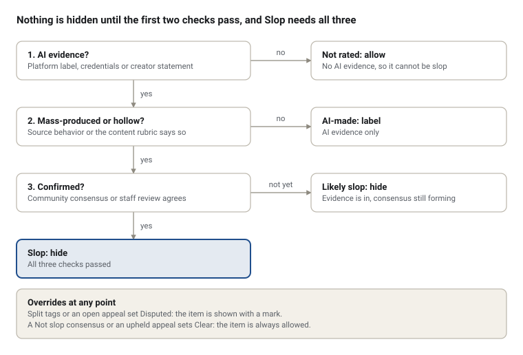
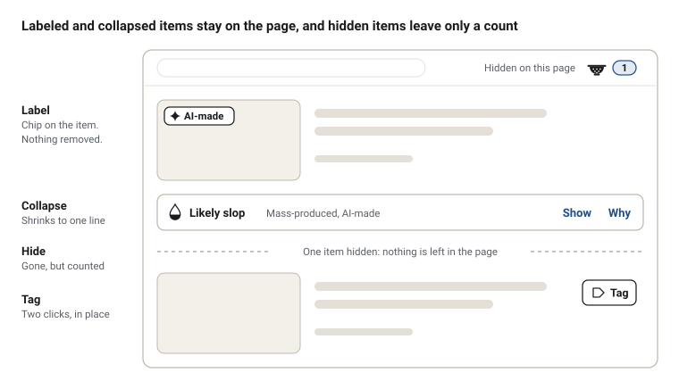
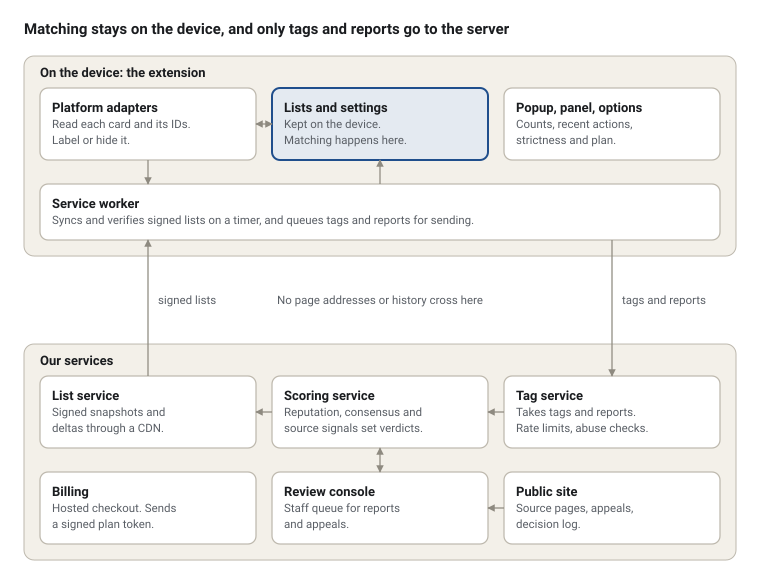
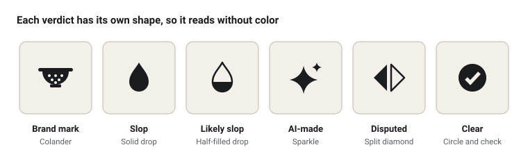
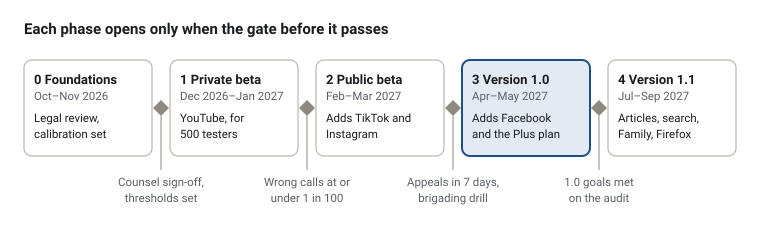

# AI Slop Blocker: Product Requirements

3 October 2026 · Steve

## Summary

This spec defines a Chrome extension that hides AI slop on YouTube, Facebook, Instagram and TikTok, the way an ad blocker hides ads. Users can tag and report videos, images, articles, channels and profiles, and those reports feed shared blocklists that every install uses.

| Decision | What this spec chooses |
| --- | --- |
| Definition | Slop is AI-made content that also meets two of three tests: low effort, mass-produced, hollow. AI use alone never counts. |
| Detection | Four evidence layers: provenance labels, source behavior, a content rubric and community consensus. No AI detector acts as judge, and two layers must agree before anything is hidden. |
| Unit | Verdicts attach to sources first: channels, profiles and pages. There are five verdicts and three strictness levels. |
| Fairness | Every action is explained and reversible. Creators can appeal and are unhidden while the appeal is reviewed. |
| Scope | Version 1.0 covers YouTube, TikTok, Instagram and Facebook in desktop Chrome. Articles and search results follow in 1.1. Native mobile apps are out of reach. |
| Money | Blocking is free. Plus costs $3 a month or $30 a year, Family $6 or $60, and donations are open to all. Paying never changes a verdict. |
| Name | Colander, as a working name. "AI Slop Blocker" is already taken. |
| Timing | Version 1.0 lands about seven months after an October 2026 start. |

Goal targets, prices and scoring thresholds are starting hypotheses to test in beta, apart from the 80% source rule borrowed from Kagi.

## Problem and opportunity

AI slop is now a large share of what these platforms show by default, and no platform lets a viewer switch it off. Platform controls reduce it at best, so the only place a person can enforce "none" is their own browser.

| What a new account is shown | Share that was AI slop |
| --- | --- |
| TikTok For You feed, first 500 videos | 59% |
| YouTube Shorts feed, first 500 videos | 21% |
| TikTok Kids category, 2,000 videos | 57.4% |
| TikTok Science and Education | 35.0% |
| TikTok Health | 33.8% |
| TikTok History | 33.5% |

Source: [Kapwing's TikTok AI Slop Report](https://www.kapwing.com/resources/the-tiktok-ai-slop-report/), data from May 2026. Kapwing sells video editing tools and classified videos by hand, counting only obvious cases, so treat these as indicative.

| Platform | What it does today | What it leaves open |
| --- | --- | --- |
| YouTube | Cut ad revenue for channels running automated slop production in 2025. The [CEO's 2026 letter](https://blog.youtube/inside-youtube/the-future-of-youtube-2026/) names "managing AI slop" a priority and requires creators to disclose realistic altered or synthetic content. | No viewer setting hides it. Disclosure depends on the creator and covers only realistic content. |
| TikTok | Requires labels on realistic AI content, has labeled 1.3 billion videos, and is testing a slider to see less AI content. | The slider reduces AI content but does not block it. |
| Facebook and Instagram | Meta describes AI-generated content as the next phase of social feeds and launched Vibes, an AI-generated feed. | This research found no viewer control for reducing AI content. |

Platform details come from the [Columbia IGP report](https://igp.sipa.columbia.edu/sites/igp/files/2026-06/AI%20Slop%20and%20the%20Information%20Ecosystem_IGP%20Report.pdf) (June 2026) unless linked otherwise.

That report explains why the gap persists. Slop sits between harmless AI content and clearly abusive content, where moderation rules have the least grip and engagement revenue rewards volume. A viewer-side tool does not need a platform to decide that slop breaks a rule. It only needs the viewer to decide they do not want it.

## Defining AI slop

For this product, AI slop is AI-generated content that is mass-produced with little human effort to capture attention or money, and that gives the viewer little in return. AI use alone never makes something slop.

Researchers agree there is no consensus definition, so this spec builds a working one from the frameworks that recur across the literature.

| Source | What it establishes | How this spec uses it |
| --- | --- | --- |
| [Kommers et al., "Why Slop Matters"](https://doi.org/10.1145/3786777), ACM AI Letters, March 2026 | Slop shares three family-resemblance features: superficial competence, asymmetric effort and mass producibility. | These become the three tests below. |
| [Silbey and Hartzog, "AI Slop"](https://cyberlaw.stanford.edu/publications/ai-slop/), September 2026 | Three parts: negligible exertion, asymmetrical imposition on the recipient, and domain degradation. Work is more or less sloppy along a spectrum. | Slop is scored by degree, not declared as a yes or no. |
| [Shaib et al., "Measuring AI Slop in Text"](https://arxiv.org/abs/2509.19163), 2025 | Expert judgments track three dimensions: information utility, information quality and style quality. Yes-or-no slop calls vary by person. Not all AI text is slop. | The tagging rubric asks about usefulness, accuracy and sameness, and users set their own strictness. |
| [Columbia IGP report](https://igp.sipa.columbia.edu/sites/igp/files/2026-06/AI%20Slop%20and%20the%20Information%20Ecosystem_IGP%20Report.pdf), June 2026 | Slop is a subset of AI-generated content: high volume, made quickly, tuned for engagement. It sits between benign AI content and deliberately harmful content. | Scope stops at slop. Abuse such as scams and deepfakes is routed to platform reporting. |
| Mantzarlis and Silverman taxonomy, The Indicator (in the IGP report) | Form is expressive or deceptive. Goal is economic or social and political. | Deceptive slop is hidden first. Openly artificial, expressive work is labeled, not hidden. |
| DiResta framework (in the IGP report) | Behavior such as volume, automation and coordination tells you more than how content looks. Slop varies by whether it routes viewers to an action. | Source behavior outweighs content appearance in scoring. Link funnels raise the score. |
| [Madsen and Puyt, "The 7Vs of AI Slop"](https://papers.ssrn.com/sol3/papers.cfm?abstract_id=5558018), 2025 | Seven dimensions, including volume and velocity. | Posting volume and cadence are measured per source. |

### The working definition

An item or source is slop when it is AI-generated and meets at least two of three tests.

| Test | Question | Research root |
| --- | --- | --- |
| Low effort | Is there little sign of human authorship, such as original footage, commentary, editing judgment or fact-checking? | Asymmetric effort, negligible exertion |
| Mass-produced | Does the source publish at a volume and sameness that points to an automated pipeline? | Mass producibility, volume, velocity |
| Hollow | Does it look competent while carrying little information, containing errors, or existing mainly to hold attention or push a link? | Superficial competence, information utility and quality |

### What is not slop

- AI-assisted work with clear human authorship, such as AI used for editing, captions, dubbing or illustration.
- Openly artificial art, satire, parody and political expression. The IGP report documents real expressive and dissent value here.
- Low-quality human-made content. It may be bad, but it is out of scope.
- Deepfakes, fraud and intimate-image abuse. These are harms beyond slop and belong with platform and legal reporting.

### Three types users can tag

| Type | What it is | Example |
| --- | --- | --- |
| Filler | Generic content tuned for engagement, with no real subject and no next step | Surreal animal clips, endless AI "history" narration |
| Bait | Slop that routes the viewer to a link, product, install or scam | AI image posts with affiliate links in the comments |
| Deceptive | Synthetic content presented as real | Fabricated news events, fake rescue videos |

The unit that matters most is the source: the channel, profile or page. Slop is a production pattern, and patterns show at the source level long before a single item gives itself away.

## Detection heuristics

No single signal hides anything. The extension scores each source and item from four evidence layers and hides by default only when two independent layers agree.

### Why an AI detector cannot be the method

- Open-source detectors lose about half their accuracy on real social media. On the [Deepfake-Eval-2024 benchmark](https://arxiv.org/abs/2503.02857v1), AUC fell 50% for video, 48% for audio and 45% for images.
- Text detectors punish the wrong people. Seven detectors flagged 61.3% of TOEFL essays by non-native English writers as AI-written ([Liang et al., 2023](https://pmc.ncbi.nlm.nih.gov/articles/PMC10382961/)).
- Detecting AI is not detecting slop. Shaib et al. treat the two as different tasks and found standard automatic measures did not reproduce editors' judgments.
- Labels and watermarks can be stripped, covered or never applied, as the IGP report notes.

Detector models are therefore optional, run on the device, and can only add weight to the "AI-made" question. They can never mark something as slop.

### The four evidence layers

| Layer | Question | Signals | Method it borrows |
| --- | --- | --- | --- |
| 1. Provenance | Is it AI-generated? | AI labels the platform shows on the page. [C2PA Content Credentials](https://opensource.contentauthenticity.org/docs/c2pa-js/packages/c2pa-web/) that mark the source type as AI-generated. The creator's own statement in a bio, description or hashtag. A visible generator watermark. | Platform disclosure rules, the C2PA standard |
| 2. Source behavior | Is it mass-produced? | Uploads per day. Share of recent items with AI evidence. Near-identical titles, thumbnails and captions. Hashtag stuffing. Clusters of sources posting the same material. Link funnels in descriptions and comments. | [Kagi SlopStop](https://help.kagi.com/kagi/features/slopstop.html), DiResta's actor-behavior-content lens, YouTube's inauthentic content policy |
| 3. Content rubric | Is it low effort and hollow? | Answers taggers give to a short rubric: useful, accurate, original. Plus text checks for filler, repetition and leftover chatbot boilerplate. | Shaib et al., [NewsGuard's four criteria](https://www.newsguardtech.com/special-reports/ai-tracking-center/), Kapwing's coding rule |
| 4. Community consensus | Do people who usually disagree both call it slop? | Tags and counter-tags weighted by tagger reputation. Agreement across tagger groups. Creator appeals. | [Community Notes bridging](https://arxiv.org/pdf/2512.19947), [SponsorBlock](https://web.sponsor.ajay.app/about) voting, Kagi's review and re-review |

### Concrete checks by content type

| Target | Checks | Where the check comes from |
| --- | --- | --- |
| Channel, profile or page | Most recent items are AI-generated, with 80% as the bar for "mostly". Posting cadence no person could sustain. One template across titles and thumbnails. Many near-duplicates. Links that route viewers off-platform. Other pages sharing the same captions. | Kagi's 80% rule. The IGP report's case of one channel posting up to 50 videos a day. [DiResta and Goldstein](https://misinforeview.hks.harvard.edu/wp-content/uploads/2024/08/diresta_spammers_scammers_ai_images_facebook_20240815.pdf), who studied 125 Facebook Pages. |
| Video | Platform AI label. Synthetic narration over stock or generated visuals. Narration glitches. No original footage or on-camera presence. Compilation format with a generated script and voice. Description stuffed with hashtags. | Kapwing's coding rule, the AI history channel case in the IGP report |
| Image post | Platform AI label or Content Credentials. Misspelled or misshapen lettering. Caption that fishes for engagement unrelated to the image. Same image family across many pages. | DiResta and Goldstein, Kapwing |
| Article or site | Substantial AI text. No sign of human oversight. Presented as human-written. No disclosure. Chatbot error text left in. Generic newsroom-style name. Padding and repetition. | NewsGuard's four criteria, Shaib et al. |

### Verdicts and what they trigger

| Verdict | Evidence required | Default action |
| --- | --- | --- |
| Slop | AI evidence, plus a mass-produced source, plus community consensus or staff review | Hide |
| Likely slop | AI evidence, plus behavior or rubric signals, with consensus still forming | Hide |
| AI-made | AI evidence only | Label |
| Disputed | Tags and counter-tags split, or an appeal is open | Show, with a disputed mark |
| Clear | "Not slop" consensus or a successful appeal | Allow |

The actions shown are those of the Standard level.
Label labels everything that carries AI evidence, and No AI also hides AI-made items.

### Safeguards against wrong calls

1. AI evidence is a gate. Without it, nothing can be rated slop, however low its quality.
2. Two layers must agree before anything is hidden by default.
3. Mixed sources are never hidden as a whole. Their AI items get item-level labels, following Kagi's rule.
4. Sources with large audiences need staff review before a list-wide Slop verdict.
5. Every hidden item states which signals fired, and one click reveals it.
6. Source verdicts expire and are re-scored every 90 days. An appeal triggers re-review at once.

Numeric thresholds, other than Kagi's published 80%, are starting values. They are calibrated against a hand-labeled set of at least 1,000 sources before launch.

### How consensus is computed

Each install gets a random pseudonymous ID, as SponsorBlock does. A tag applies on the tagger's own device at once and enters the shared pool with a weight based on that tagger's track record. Phase 1 uses reputation-weighted thresholds plus staff review. Bridging, where a verdict needs agreement between groups that usually tag differently, is added once tag volume supports it.

## Existing tools

The market is crowded on YouTube and nearly empty everywhere else. No tool found pairs a shared, cross-platform list with a published definition of slop and a way for creators to appeal.

| Tool | Covers | How it decides | Model |
| --- | --- | --- | --- |
| [AiBlock and AiSList](https://aisloplist.com/) | YouTube, on Chrome and Firefox | Removes channels on a community list of 12,826 channels. Reports arrive through an in-player flag, Discord or GitHub issues. | Free, MIT licensed, volunteer-run with no funding |
| [AI Block for YouTube](https://addons.mozilla.org/en-US/firefox/addon/ai-block-for-youtube/) | YouTube, on Firefox | Plain-text channel blocklist on GitHub, refreshed every 4 hours. A report opens a GitHub issue for manual checking. | Free |
| [SlopBlock](https://slopblock.cc/) | YouTube | Users mark videos as AI-generated. Warning icons appear once a community trust threshold is reached. Trust scores combine time and accuracy. | Free, open source |
| [AI Slop Blocker (Vlad)](https://vladeeno.com/ai-slop-blocker) | YouTube, Google Search | One-click personal blocklist. Hides AI-disclosed videos and Google's AI Overview. Community list planned. | Free |
| [AI Content Shield](https://addons.mozilla.org/en-US/firefox/addon/ai-content-shield/) | YouTube, TikTok, X, Instagram, Facebook, Threads, search engines | Blocks AI content and AI features broadly. Pro adds AI-voice detection, custom rules and text filtering. | Freemium with a Pro subscription |
| [AI Slop Blocker (feed)](https://chromewebstore.google.com/detail/ai-slop-blocker/cnibfnnnmlbhhmojfnlpdiddfbmobdan) | Social feeds | Scores post text with an on-device model. | Free |
| [DeSlop](https://chromewebstore.google.com/detail/deslop-ai-slop-filter-for/ceeofbgdnlfkbmejalfggfkigjmkdkib) | LinkedIn | Scores posts for signs of AI writing on the device, then hides, collapses or dims. Every hide is explained and reversible. | Free |
| [FeedShield](https://chromewebstore.google.com/detail/feedshield/ngpbogmnapokeceaaaegjgmaabgppifd) | X | Sends posts to a cloud model for classification. | Free |
| [Kagi SlopStop](https://help.kagi.com/kagi/features/slopstop.html) | Kagi search results | User reports are reviewed one by one, usually within a week. A domain is downranked when more than 80% of its pages are AI-generated. Mixed domains get page labels only. Anyone can file a "not AI slop" report. | Part of a paid search engine |
| [HUGE AI Blocklist](https://github.com/laylavish/uBlockOrigin-HUGE-AI-Blocklist) | Search engines, through uBlock Origin | A hand-curated filter list of 1,000+ domains. A separate "nuclear" list holds sites that mix real and AI content. | Free |
| [Slop Evader](https://www.tomsguide.com/computing/search-engines/fed-up-with-ai-slop-in-google-results-this-extension-rolls-searches-back-to-pre-chatgpt-times) | Search on Google, YouTube, Reddit and others | Limits results to before 30 November 2022. | Free |

As of early October 2026. AI Content Shield (20,000+ Chrome users) and AiBlock (about 10,000) were the largest found. The classifier-based tools each listed fewer than 400 users.

### Models worth copying

| Tool | What it proves |
| --- | --- |
| [SponsorBlock](https://web.sponsor.ajay.app/about) | A random per-install ID, votes and reputation are enough to run a trusted crowdsourced database without accounts. The full database is public. |
| [DeArrow](https://github.com/ajayyy/DeArrow) | A crowdsourced YouTube extension can sell a license key and stay open source. |
| Kagi SlopStop | Judging the source by its share of AI content, with re-review on request, is workable and explainable. |
| TikTok and [Pinterest](https://techcrunch.com/2025/10/16/pinterest-adds-controls-to-let-you-limit-the-amount-of-ai-slop-in-your-feed/) controls | Platforms accept that users want less AI content, yet their controls reduce it without removing it. |

### What this means for the product

1. Go beyond YouTube. Community-list tools stop at YouTube. Facebook, Instagram and TikTok have only broad AI blockers.
2. Block slop, not AI. Most tools list "AI channels" with no stated bar. Only Kagi publishes one.
3. Give creators due process. Reviews today run through GitHub issues and Discord, with no appeal path outside Kagi.
4. Do not lead with a classifier. Those tools have the fewest users and carry the detector error rates described above.
5. Fund it. Nearly every tool is an unfunded volunteer project, which limits review capacity and platform upkeep.
6. Start with a seed list. AiSList is MIT licensed, so it can seed YouTube coverage with attribution, after re-scoring against this spec's definition.
7. Pick a distinct name. At least two extensions are already called "AI Slop Blocker", and SlopBlock, SlopStop, DeSlop and Slop Evader are taken.

## Personas and user experience

Four people use this product, and the first one decides whether it succeeds: a viewer who installs it, changes nothing, and sees a cleaner feed within a minute.

### Personas

| Persona | Who they are | What they want | What they fear | Likely plan |
| --- | --- | --- | --- | --- |
| Maya, the fed-up viewer (primary) | 29, watches YouTube and TikTok daily. Tired of AI narration channels in her recommendations. | Install once and have it work. See what was removed. Fix a wrong call in one click. | Missing something good. A tool that breaks the site or needs constant tuning. | Free |
| Daniel, the guardian | 41, two children aged 4 and 7 on a shared laptop. Also set it up for his mother, who uses Facebook. | The strictest setting for kids' content, locked so it stays on. Plain labels his mother can read. | Children's feeds filling with AI cartoons, where Kapwing found slop above 57%. | Paid, family |
| Priya, the human creator | 34, runs a small history channel and is losing views to AI channels. Uses AI for captions and translation. | Report slop channels and see it matter. Proof her own channel is in the clear. | Being tagged as slop herself, with no way to answer. | Free, frequent tagger |
| Sam, the curator | 37, maintains filter lists as a hobby. Reviews reports for the shared list. | A fast review queue, the evidence in one view, and a public log of decisions. | Brigading, and a list he cannot audit. | Supporter or paid |

Researchers and journalists are a secondary audience. They need the public list and decision log, not the extension.

### Experience principles

1. It works on install. No account, no setup, sensible defaults.
2. Nothing disappears silently. Every action is counted, explained and reversible.
3. Tagging takes two clicks, on the content itself.
4. The user sets the strictness. The product never decides what an adult may see.
5. Creators get fair treatment. Labels describe the content, never the person, and every label links to an appeal.
6. Browsing stays private. List matching happens on the device.

### Strictness levels

| Level | Slop | Likely slop | AI-made | Disputed | Clear |
| --- | --- | --- | --- | --- | --- |
| Label | Label | Label | Label | Label | Allow |
| Standard (default) | Hide | Hide | Label | Label | Allow |
| No AI | Hide | Hide | Hide | Label | Allow |

Owner decision, 3 October 2026: there are three levels only, and the collapse treatment is gone.
Strict and collapse are gone from every surface, with no grid stubs, collapsed bars or swipe-feed covers.
Settings stored or synced with Strict, globally, per platform or per topic, read as Standard.
Disputed always stays visible with its mark, and Clear is never touched.

### What each action looks like

| Action | In a grid or list | In a swipe feed such as Shorts, Reels or the For You page |
| --- | --- | --- |
| Label | A small chip on the thumbnail with the verdict | The same chip beside the creator name |
| Hide | The card is not shown, and the page closes up with no gap, blank box or placeholder, the way an ad blocker removes an ad. Grids reflow so their rows stay full, also before a shelf. The toolbar count goes up. | The video is skipped silently. An Appearance setting, off by default, adds a brief notice with Undo and Why. |

Removal is seamless, but nothing is lost.
Every hidden item is counted on the toolbar badge and listed in the popup with Show, Always allow, Not slop and Why, so every call can be checked and fixed.

This is a sketch of a results list, not final art. Chips are outlined here and carry the verdict colors in the product.

### Core journeys

**First run**

1. Maya installs from the Chrome Web Store. A welcome tab opens.
2. She sees the definition of slop in two sentences and the three strictness levels. Standard is preselected.
3. She picks which platforms to switch on. Chrome asks for site access only for those.
4. She opens YouTube. The toolbar icon shows a count as items are hidden.

**Passive blocking**

1. The page loads and the extension checks each card against the lists on the device.
2. Matched items are labeled or hidden before they are seen where possible. Hidden items leave no gap.
3. Clicking the toolbar icon lists what was acted on, with Show, Always allow, Not slop and Why for each item.

**Tagging an item**

1. Maya opens the menu on any video, post or article and picks the extension's Tag button.
2. She chooses Slop, AI-made but fine, or Not slop.
3. If she chose Slop, she can add a type (Filler, Bait or Deceptive) and tick which tests apply.
4. The tag applies on her device at once and joins the shared pool.

**Reporting a source**

1. On a channel, profile or page, Priya chooses Report source.
2. The form pre-fills the source and its recent items. She picks up to three examples and a reason.
3. The report appears in My reports with a status: Under review, Slop, Likely slop or Clear.
4. She is notified when the verdict lands and sees how many installs it now protects.

**Fixing a wrong call**

1. A labeled item shows a Why link listing the signals that fired. A hidden item has the same Why in the popup.
2. Show reveals it once. Always allow adds the source to the viewer's own allowlist.
3. Not slop files a counter-tag, which can move the verdict to Disputed.

**Appealing as a creator**

1. Every label links to a public page for that source, showing the verdict and evidence.
2. The creator proves control of the account by adding a short code to its description.
3. They state their case. The verdict changes to Disputed and the source is unhidden while staff review.
4. The outcome and reasoning are published in the decision log.

**Guardian setup, with the Family plan from 1.1**

1. Daniel creates a child profile, sets it to Standard, and adds No AI for children's categories.
2. He locks settings with a PIN.
3. For his mother, he picks Label so nothing vanishes, with larger plain-language chips.

### Surfaces

| Surface | Purpose |
| --- | --- |
| Toolbar popup | Pause on this site, strictness, today's counts, recent actions |
| In-page elements | Chips, Tag button, Why popover, notices |
| Side panel | Review queue and evidence view for curators |
| Options page | Lists, platforms, profiles, appearance, plan, data export |
| Website | Public source pages, appeals, decision log, plans, donations |

### Accessibility

All in-page elements meet WCAG 2.2 AA. Verdicts are never shown by color alone. Every control is reachable by keyboard and named for screen readers, and motion respects the reduced-motion setting.

## Requirements

Version 1.0 does three things on four platforms: it blocks from shared lists, lets anyone tag and report, and explains every action it takes. Web articles and search results follow in 1.1.

### Goals

| Goal | Target at 1.0 | How it is measured |
| --- | --- | --- |
| Viewers see far less slop | 80% less slop in a fresh YouTube Shorts feed and 60% less in a fresh TikTok feed on Standard | Monthly audit of the first 500 items on a new account, following Kapwing's method |
| Wrong calls are rare | At most 1 in 100 hidden items judged a wrong call | Monthly blind review of 500 hidden items by two reviewers |
| The community does the finding | 5% of weekly active users tag at least once a week | Tag events per weekly active install |
| Creators get answers | Median appeal resolved within 7 days | Appeal log timestamps |
| The work pays for itself | 3% of monthly active users paying or donating monthly by month 12 | Billing records against active installs |

These targets are hypotheses to test in beta, not benchmarks from comparable products.

### Non-goals

- Proving whether a given item is AI-generated. The product weighs evidence and shows it.
- Blocking all AI content by default. That is a setting, not the premise.
- Acting as a safety or misinformation tool. Deepfakes, scams and abuse get a shortcut to the platform's own reporting.
- Covering native mobile apps. A Chrome extension runs in desktop browsers only.
- Blocking ads, or acting on the user's account, such as auto-clicking Not interested.
- Collecting browsing history. Only tags and reports the user chooses to send leave the device.

### User stories

**Viewer**

- As a viewer, I want slop removed from my feeds without setup, so that I can keep using the sites I already use.
- As a viewer, I want to see what was hidden and why, so that I can trust the tool and undo mistakes.
- As a viewer, I want to tag slop in two clicks, so that helping costs me nothing.
- As a viewer, I want to choose how strict the filter is, so that I decide what I see.

**Guardian**

- As a parent, I want a locked profile at the strictest level for my children, so that the setting survives curious hands.
- As a caregiver, I want labels in plain words for an older relative, so that nothing vanishes without explanation.

**Creator**

- As a creator, I want to see my channel's status and the evidence behind it, so that I know where I stand.
- As a creator, I want to appeal and be unhidden during review, so that a wrong call does not cost me views.

**Curator**

- As a curator, I want one queue with the evidence for each report, so that I can decide quickly and consistently.
- As a curator, I want every decision logged in public, so that the list can be audited.

### What can be tagged and blocked

| Target | Identified by | Where | Release |
| --- | --- | --- | --- |
| Channel, profile or page | Platform account ID | YouTube, TikTok, Instagram, Facebook | 1.0 |
| Video, Short or Reel | Platform video ID | All four | 1.0 |
| Image post | Platform post ID | Instagram, Facebook | 1.0 |
| Article or site | Domain or URL | Open web and search results | 1.1 |

### Must have for 1.0 (P0)

| ID | Requirement | Acceptance criteria |
| --- | --- | --- |
| P0-1 | Block from lists. Items from listed sources are labeled or hidden according to the strictness level. A hidden item leaves no gap, and grids reflow so their rows stay full. | Given Standard, when a card from a Slop source renders, then it is hidden within 150 ms at the 95th percentile with no layout jump. Works through infinite scroll and in-page navigation. |
| P0-2 | Four platform adapters. YouTube: home, search, watch sidebar, Shorts, subscriptions, channel pages. TikTok: For You, search, profiles. Instagram: feed, Reels, Explore. Facebook: feed, Reels, suggested posts. | Each surface passes an automated test daily. A broken selector is fixed through a signed configuration update within 24 hours, with no code change. |
| P0-3 | Strictness levels and pause. Three levels, plus pause for this site or this tab. | Changing the level re-applies to the open page within 1 second without a reload. |
| P0-4 | Read platform AI labels. The platform's own AI disclosure on an item counts as provenance evidence. | Given a labeled item with no list entry, then it shows the AI-made chip. |
| P0-5 | Tag an item as Slop, AI-made but fine, or Not slop, with optional type and tests. | Two clicks from any card. The tag applies locally at once and queues when offline. |
| P0-6 | Report a source with up to three example items and a reason. | The report appears in My reports with a status that updates when a verdict is set. |
| P0-7 | Why, Show and Always allow on every acted-on item. | Why lists each signal that fired. Always allow overrides every list for that viewer. |
| P0-8 | Shared list sync. A signed core list updates at least every 6 hours as a delta. | Blocking works offline from the last copy. A full sync of 50,000 sources stays under 2 MB. |
| P0-9 | Consensus and review service. Reputation-weighted tags, the five verdicts, and a staff review queue. | No source reaches Slop on tags alone without meeting the two-layer rule. |
| P0-10 | Appeals. A public page per source, account verification, unhiding during review, and a decision log. | A verified appeal sets the verdict to Disputed within 1 minute for all installs at next sync. |
| P0-11 | Privacy by default. No account needed. A random install ID. No page URLs or history sent. | A network audit shows only list downloads and user-submitted tags and reports. |
| P0-12 | Counts and activity. Toolbar count for the page and a list of recent actions. | Each entry offers Show, Always allow and Not slop. |
| P0-13 | Plus and support. The Plus plan and donations can be bought, and free blocking is never limited. | Free users can block, tag, report and appeal on all four platforms. |
| P0-14 | Accessibility. WCAG 2.2 AA for every element the extension adds. | Audit passes with keyboard-only and screen-reader runs. |

### Should have, fast follow (P1)

- Articles and search results: label or hide listed slop domains on Google, Bing and DuckDuckGo, and show a banner on listed sites.
- Content Credentials: read C2PA data on open-web images and show the AI-made chip.
- Custom lists: subscribe to third-party lists, and import or export personal lists.
- The Family plan: up to 5 profiles, child profiles with a PIN lock, and a shared family list.
- Private lookups for items missing from the local list, using hash prefixes so the server never learns the item.
- Bridging-based consensus once tag volume supports it.
- An optional on-device model that adds weight to the AI-made question only.
- More platforms: X, Reddit, LinkedIn, Pinterest and Threads.
- Firefox and Edge builds.

### Later (P2)

- Safari on iOS and Firefox for Android.
- A public dataset and API for researchers.
- Opt-in feed training that sends Not interested on the user's behalf.
- A human-made pledge that creators can verify and display.
- Trusted partner lists, for example a children's content list kept by a child-safety group.

### What a tag contains

Platform, target type, target ID, verdict, optional type and tests, whether a platform AI label was present, install ID, time and extension version. It never contains the page the user was on, their account name or their watch history.

## Technical approach

The extension works like an ad blocker's cosmetic filter: it downloads a signed list, matches items on the device, and hides page elements. It never asks a server about the page a user is viewing.

Lists reach the device on the left and tags leave it on the right. The services turn tags into verdicts, and the next list carries those verdicts to every install.

### How the parts work

| Part | What it does | Key choices |
| --- | --- | --- |
| Platform adapters (content scripts) | Find each card, read its source and item IDs, read any platform AI label, apply the treatment, add the Tag button | One adapter per platform. Selectors ship as signed configuration so a site redesign is fixed without a store review. |
| Service worker | Syncs lists, verifies signatures, queues tags, checks plan entitlement | Lists live in IndexedDB. Sync runs on a timer, not on page views. |
| Extension UI | Popup, side panel, options page | Packaged with the extension. No remote scripts. |
| List service | Publishes signed snapshots and deltas through a CDN | Compact hashed IDs. 50,000 sources fit well under 2 MB. |
| Tag service | Receives tags and reports, applies rate limits and abuse checks | Accepts only the fields listed under Requirements. |
| Scoring service | Computes reputation, consensus and source-behavior signals, then sets verdicts | Enriches YouTube sources through the official Data API. Other platforms rely on on-page signals and reports. |
| Review console and public site | Staff queue, source pages, appeals, decision log | Every verdict change writes a public log entry. |
| Billing | Checkout, subscriptions, donations, entitlements | Hosted checkout. The extension stores only a signed plan token. |

### Constraints that shape the design

- Chrome's Manifest V3 requires all logic to ship inside the package. Remote data and configuration are allowed, remote code is not ([Chrome documentation](https://developer.chrome.com/docs/extensions/develop/migrate/improve-security)). Lists and selectors are therefore plain data, and the configuration format stays declarative.
- Matching is local, so no browsing data leaves the device and blocking works offline.
- Adapters observe page changes and classify each card as it is inserted, which lets most items be hidden before they are painted.
- Permissions stay minimal: site access for enabled platforms only, storage, alarms and the side panel. No history, no tabs, no network interception.
- Brigading defenses sit on the server: per-install rate limits, low weight for new installs, burst detection on a single source, and staff review for large sources.

### Libraries, data and services we can use

| Need | Option | License or terms | Use and caution |
| --- | --- | --- | --- |
| Extension framework | [WXT](https://github.com/wxt-dev/wxt) | MIT | Builds Manifest V3 for Chrome and later Firefox and Edge. |
| Provenance reading | [c2pa-web](https://opensource.contentauthenticity.org/docs/c2pa-js/packages/c2pa-web/) from the [c2pa-js](https://github.com/contentauth/c2pa-js) project | MIT | Reads Content Credentials in the browser. Its inline build embeds the WebAssembly, which fits the no-remote-code rule. |
| YouTube seed list | [AiSList](https://aisloplist.com/) | MIT | 12,826 channels. Use with attribution and re-score each entry, since its bar is "AI channel", not this spec's definition. |
| Site seed list for 1.1 | [HUGE AI Blocklist](https://github.com/laylavish/uBlockOrigin-HUGE-AI-Blocklist) | License file present, type to confirm | 1,000+ curated domains. Confirm terms before bundling. |
| Crowdsourcing design | [SponsorBlock](https://github.com/ajayyy/sponsorblockserver) | Extension GPL-3.0, server AGPL-3.0-only, [database CC BY-NC-SA 4.0](https://sponsor.ajay.app/database) | Study the design. Do not copy code or data into a commercial product without meeting those terms or getting permission. |
| Consensus method | [Community Notes scoring](https://github.com/twitter/communitynotes) | Code is published, license to confirm | Reimplement bridging from the published method. Confirm the license before reusing code. |
| Slop dataset | Kagi SlopStop | Not yet published | Kagi has said it will share its database. Ask about terms. |
| News site ratings | NewsGuard | Commercial license | Not usable without a contract. Its public criteria can inform the rubric. |
| Filter-list syntax | uBlock Origin | GPL-3.0 | Its code cannot be bundled into a non-GPL product. Write a small parser for the hostname subset. |
| YouTube metadata | YouTube Data API | Google's API terms and developer policies, with daily quota | Use for public channel and upload metadata. Review storage and display rules with counsel. |
| TikTok and Meta metadata | None suitable | Research APIs are limited to approved researchers | No server-side scraping. Use on-page signals and user reports. |
| Optional on-device model | ONNX Runtime Web, Transformers.js | MIT, Apache-2.0 | Each model has its own license. Many detectors are non-commercial, so check every model card. |
| Payments | Stripe, [ExtensionPay](https://extensionbooster.net/blog/how-to-monetize-browser-extension-payment-integration-guide/) (as compared in this guide), or a merchant of record such as Paddle or Lemon Squeezy | Commercial terms | Chrome Web Store payments were retired in 2021. A merchant of record handles sales tax and VAT. |

Licenses were read from project pages in October 2026. Each should be re-checked by counsel before code or data is bundled.

### Open source position

The recommendation is to publish the extension's source and the full list. A blocker asks for trust, and auditable code and data are the cheapest way to earn it. The choice of licenses is an open question below.

## Business model

Blocking is free for good, and paying buys convenience and control, never influence. Money comes from one low-priced subscription and from donations, with no ads, no data sales and no paid allowlisting.

### Plans

| Plan | Price | What it includes | Available |
| --- | --- | --- | --- |
| Free | $0 | Blocking on every supported platform with the core list. All three strictness levels. Tagging, reporting and appeals. Personal block and allow lists, and third-party lists once they ship in 1.1. | Beta onward |
| Plus | $3 a month or $30 a year | Everything in Free. Sync across browsers. Strictness per platform and per topic. Keyword and hashtag rules. A weekly summary. Early access to new platforms. | 1.0 |
| Family | $6 a month or $60 a year | Everything in Plus for up to 5 profiles. Child profiles with a PIN lock. A shared family list. | 1.1 |
| Supporter | Any amount, once or monthly | No extra features. Optional credit on the supporters page. | Public beta onward |

The closest competitor, AI Content Shield, charges $6.00 a month or $4.95 a month billed yearly for its Pro tier ([its FAQ](https://www.aicontentshield.app/faq)). Plus is priced at half that because the core job, blocking, stays free here. Prices are hypotheses to test with a price-sensitivity survey during beta.

### The path from free to paid

1. Install and use it free, with no account.
2. After the first week, the popup shows one dismissible card with the user's own numbers and two choices: Get Plus or Support our work. It appears at most once every 30 days.
3. Opening a paid feature shows what it does and offers a 14-day trial with no card.
4. Checkout runs on the website through a hosted checkout. An emailed sign-in link creates the account.
5. The extension receives a signed plan token. Cancelling takes one click on the account page, and refunds are given within 30 days.

### Support our work

- The link sits in the popup footer, the options page and the website. It never appears on appeal or source pages, so no creator is asked for money while their case is open.
- Donors choose once or monthly, with suggested amounts of $3, $5 and $10.
- If the code is open source, two established routes open up. GitHub Sponsors charges no fee on sponsorships from personal accounts. Open Collective shows a public budget, and its open-source fiscal host takes about 10%.
- A yearly report publishes income by source and spending by category.

### Billing choices

Chrome Web Store payments were retired in 2021, so billing runs through a third party. Fees below use rates quoted in a [2026 payments guide](https://extensionbooster.net/blog/how-to-monetize-browser-extension-payment-integration-guide/) and should be confirmed with each vendor.

| Charge | Direct card processor, about 2.9% + $0.30 | Merchant of record, about 5% + $0.50 |
| --- | --- | --- |
| $3 monthly | $0.39, or 13% | $0.65, or 22% |
| $30 yearly | $1.17, or 3.9% | $2.00, or 6.7% |
| $60 yearly | $2.04, or 3.4% | $3.50, or 5.8% |

Two decisions follow. Yearly billing is preselected, because fixed fees eat a fifth of a $3 monthly charge. A merchant of record is the launch choice, because it handles sales tax and VAT in every country for a small team.

### Independence rules

1. Free blocking is never reduced to push upgrades.
2. Paying or donating never changes tag weight, review priority or any verdict.
3. No creator, platform or advertiser can pay to leave a list or join an allowlist.
4. No ads, no affiliate links, and no sale or sharing of user data.
5. Every funding source is published.

### Scale check

At 100,000 monthly users and the 3% target, Plus at $30 a year brings in about $90,000 a year before fees. A staffed review team needs several times that, so early funding should include donations and grants from foundations that fund information-ecosystem work.

## Brand and design system

The working name is Colander: it drains the slop and keeps the substance. The system gives the product one plain voice, five verdict marks that read without color, and color tokens that all pass WCAG AA.

### Brand foundation

| Element | Decision |
| --- | --- |
| Working name | Colander. A colander drains liquid and keeps the food, slop is liquid waste, and nobody needs the object explained. |
| Store title | Colander: drain the slop from your feed |
| Tagline | Drain the slop. Keep the substance. |
| Alternates | Decant, Sluice |
| Ruled out | Winnow, already [a YouTube feed extension](https://addons.mozilla.org/en-US/firefox/addon/winnow/). Anything built on "slop" plus block, stop or evader. "AI Slop Blocker", used by at least two extensions. |

A web search found no browser extension called Colander. The name still needs trademark and store clearance.

| Trait | What it means | What it rules out |
| --- | --- | --- |
| Plain | Kitchen-drawer words. Says what happened. | Jargon such as "classifier confidence" |
| Calm | No alarms, no red banners, no exclamation marks | "WARNING: AI detected!" |
| Fair | Describes content, and always links to an appeal | "Fake", "bot", "garbage", or any name-calling |
| Open | Shows the evidence, the counts and the funding | Anything hidden without a trace |

### Logo and motif

- The mark is a colander seen from the side: a round bowl, a flat rim with two handles, three rows of holes and a small foot.
- At 16 px it simplifies to the bowl and three holes.
- The supporting motif is a grid of perforation dots, used in empty states, illustrations and the loading animation.
- The toolbar icon has three states: active (filled mark with a count badge), paused (outlined mark at half strength) and attention (a dot at the top right for a sync failure or an appeal update).

All six marks are drawn in one ink color here to show that shape alone tells them apart. In the product, each verdict glyph also takes its verdict color.

### Color tokens

| Token | Light | Dark | Use | Contrast with its surface |
| --- | --- | --- | --- | --- |
| surface | #FFFFFF | #15171A | Popup, panel and page background | |
| surface-raised | #F3F0E9 | #1F2226 | Segmented tracks and row hover | |
| border | #D9D5CC | #3A3E44 | Dividers | |
| text | #1A1C1F | #F2F0EB | Body text | 17.1:1 light, 15.8:1 dark |
| text-muted | #5A5F66 | #A7ABB1 | Secondary text, input outlines | 6.4:1 light, 7.8:1 dark |
| brand | #1F4E8C | #8FB8F0 | Buttons, links, focus ring | 8.3:1 light, 8.8:1 dark |
| paper | #FAF7F2 | | Website and welcome page background | |

| Verdict | On light | Tint behind it | On dark and on media | Contrast |
| --- | --- | --- | --- | --- |
| Slop | #A8380F | #FBE9E2 | #FF8A5C | 6.5:1 on white, 7.4:1 on ink |
| Likely slop | #7A5200 | #FBF0D6 | #FFC857 | 6.9:1 on white, 11.1:1 on ink |
| AI-made | #48535F | #ECEFF3 | #C2CAD6 | 7.8:1 on white, 10.3:1 on ink |
| Disputed | #6B3FA0 | #F0E8FA | #C8A6FF | 7.4:1 on white, 8.4:1 on ink |
| Clear | #1B6E45 | #E3F4EA | #6FD6A3 | 6.2:1 on white, 9.6:1 on ink |

Rules for color:

- Color is never the only signal. Every verdict has its own glyph shape and its word.
- Slop is rust, not alarm red. The label describes content, not an emergency.
- Brand blue is for actions only. It never stands for a verdict.
- Chips on thumbnails use an ink background (#1A1C1F) so they stay legible over any image.
- Each on-light color also clears 5.4:1 on its own tint.

### Typography

| Where | Typeface | Why |
| --- | --- | --- |
| Chips, bars and menus added to other sites | The system font stack | No fonts are loaded into host pages, which protects speed and privacy. |
| Popup, options, side panel, website | Atkinson Hyperlegible Next | Built for low-vision readers, seven weights, and free under the [SIL Open Font License](https://github.com/googlefonts/atkinson-hyperlegible). Its round details echo the dot motif. |

| Role | Size and line height | Weight |
| --- | --- | --- |
| Chip | 12 / 16 px | 600 |
| Caption | 12 / 16 px | 400 |
| Body | 14 / 20 px | 400 |
| Body large | 16 / 24 px | 400 |
| Title | 20 / 28 px | 600 |
| Display | 32 / 40 px | 700 |

Nothing is set below 12 px. Everything is sentence case. Counts use tabular figures.

### Spacing, shape and motion

| Token | Value |
| --- | --- |
| Spacing steps | 4, 8, 12, 16, 24, 32 px |
| Radius | 6 px for chips and inputs, 10 px for cards and popovers, full for badges and toggles |
| Borders | 1 px. Focus ring is 2 px brand with a 2 px offset. |
| Elevation | One shadow, for popovers only. In-page elements are flat. |
| Motion | 120 ms for hover and press, 200 ms for reveal, ease-out. None when reduced motion is set. |
| Hit targets | At least 24 by 24 px. The in-page Tag button is 28 px, popup controls 32 px. |

### Iconography

The system has two tiers.

1. Custom glyphs for the brand mark and the five verdicts. They are filled, readable at 12 px, and differ in outline so they work without color.
2. Everything else comes from [Lucide](https://composables.com/icons/icon-libraries/lucide), an ISC-licensed set drawn on a 24 px grid with a 2 px stroke.

| Verdict | Glyph | Reasoning |
| --- | --- | --- |
| Slop | A solid drop | The thing being drained |
| Likely slop | A drop, lower half filled | The same shape, half certain |
| AI-made | A four-point sparkle | The mark people already read as AI. Neutral, not a judgment. |
| Disputed | A diamond split down the middle | Two sides |
| Clear | A solid circle with a check | Settled and fine |

| Action | Lucide icon |
| --- | --- |
| Hide and Show | eye-off, eye |
| Tag and Label | tag |
| Report source | flag |
| Appeal | scale |
| Why | info |
| Pause | pause |
| Strictness | sliders-horizontal |
| Lists and sync | list, refresh-cw |
| Lock | lock |
| Support our work | heart |

Icon rules: every icon sits beside a word, except the chip glyph and the toolbar mark. Verdict glyphs are never reused for actions. No emoji, and no robot or pig imagery, which would mock the people being labeled.

### Core components

| Component | Anatomy | Rules |
| --- | --- | --- |
| Verdict chip | Glyph and verdict word | Ink background on media, tint background in panels. Never truncated. Hover or focus offers Why. |
| Tag menu | Three choices, then optional type and tests | Opens from the Tag button, closes on Escape, confirms with a notice. |
| Why popover | Signals that fired, the list, the date, links to the source page and appeal | Five lines at most |
| Skip notice | "Skipped 1 slop video", Undo and Why | Off by default; an Appearance setting turns it on. Shows for 4 seconds, announced politely to screen readers, never stacks |
| Strictness control | Three-stop segmented control | One line under it says what the chosen level does |
| Buttons | Primary in brand fill, secondary outlined, quiet as text | 32 px minimum height, with disabled and loading states |
| Source page banner | Verdict chip, evidence summary, Appeal button | Neutral layout. Verdict color appears on the chip only. |

### Vocabulary

| Group | Terms |
| --- | --- |
| Things | Item, Source, List (Core list, Community list, My list), Tag, Report, Appeal, Decision log |
| Verdicts | Slop, Likely slop, AI-made, Disputed, Clear |
| Types of slop | Filler, Bait, Deceptive |
| Tests | Low effort, Mass-produced, Hollow |
| Actions | Hide, Label, Allow, Show, Skip, Undo, Why |
| Strictness levels | Label, Standard, No AI |
| People | Tagger, Curator, Creator, Supporter |

| Say | Not |
| --- | --- |
| Tagged as slop by the community | Detected, caught, flagged as fake |
| AI-made | Fake, bot, AI garbage |
| Source | Offender, spammer |
| List | Blacklist |
| Hidden for you | Removed, banned, deleted |
| Not slop | False positive |
| Appeal | Complaint |
| Support our work | Donate now, Go premium |

### Sample copy

| Where | Copy |
| --- | --- |
| Skip notice | Skipped 1 slop video. Undo |
| Tag confirmation | Tagged. Hidden for you now, and counted toward the shared list. |
| Why popover title | Why this is hidden |
| Empty popup | Nothing hidden on this page. |
| Appeal link | Is this your channel? Appeal this verdict. |
| Support card | You skipped 240 slop items this week. Colander runs on support from people like you. |
| Paused | Paused on this site. |

Copy rules: sentence case, no exclamation marks, digits for numbers, and verdict words are never applied to a person.

## Risks

The gravest risk is hiding a real creator's work by mistake, and most of the design exists to prevent that. The table runs from most to least severe. It is a product view and not legal advice.

| Risk | Why it matters | Mitigation |
| --- | --- | --- |
| Wrong calls against real creators | A wrong Slop verdict costs an innocent person views and income. It also invites defamation and interference claims. | The AI evidence gate and two-layer rule. Staff review for large sources. Appeals that unhide during review. Labels that describe content and show evidence. Counsel review of every label and source-page phrase. Media liability insurance. |
| Platform pushback | Platforms can break adapters by changing their pages, or assert terms-of-service claims. Meta has sent cease-and-desist letters to makers of browser extensions, including Unfollow Everything and NYU's Ad Observer ([Knight Institute](https://knightcolumbia.org/blog/zuckerman-v-meta-a-user-friendly-section-230-1)). | The extension only hides page elements on the user's own device. It does not automate the account, scrape, or touch ads. Adapters are configuration-driven and tested daily. Counsel reviews each platform's terms before that platform ships. |
| Brigading and list poisoning | A coordinated group could tag rivals or political targets, and one poisoned list reaches every install. | Reputation weighting, low weight for new installs, burst detection, staff review for large sources, bridging, signed lists and a public decision log. |
| Store dependence | A Chrome Web Store rejection or takedown removes distribution overnight. | A policy checklist on every release: packaged logic only, minimal permissions, accurate data disclosures. Firefox and Edge builds in 1.1. |
| Definition drift and bias | "Slop" can slide into taste policing. Creators who use AI voices, dubbing or translation, including non-native speakers and disabled creators, could be over-tagged. | The rubric states that AI voice, dubbing and translation are not evidence of slop on their own. Reviewer guidelines. A quarterly audit of wrong calls by language and region. Published changes to the definition. |
| Evasion | Slop producers strip labels, vary templates and rotate accounts. | Source behavior and community signals do not depend on labels. Re-scoring every 90 days. Cluster detection across sources. |
| Review capacity | Reports outpace staff and the 7-day appeal target slips. | Triage by audience size, volunteer curators with spot audits, and the funding plan above. |
| Privacy and regulation | Install IDs and tags are pseudonymous personal data under laws such as the GDPR. Verdicts concern identifiable creators. Child profiles touch children's privacy rules. | Data minimization as specified. A data protection impact assessment before public beta. Child profiles stored on the device only. Retention limits. |
| Funding credibility | Any hint that money buys removal from a list would end user trust. | The independence rules, and published funding sources. |
| Seed list quality | Imported lists use a looser bar of "AI channel". | Every imported entry is re-scored. Until reviewed, an imported entry can be Likely slop at most. |
| Reliance on platform labels | Platforms can change, drop or misapply AI labels. | A label only establishes AI-made, never Slop. |

### The legal picture in the United States

Section 230(c)(2)(B) protects providers of tools that let users filter content they find objectionable. Courts have applied it to malware blockers and spam filters, but not yet to tools for social media feeds. The one test case, Zuckerman v. Meta, was [dismissed in November 2024](https://knightcolumbia.org/content/federal-judge-says-challenge-in-zuckerman-v-meta-cannot-go-forward-yet) as premature because the tool had not been built. Treat the provision as helpful and unproven, and get counsel's view on Europe and other markets before launch there.

## Rollout, metrics and open questions

The plan reaches version 1.0 on all four platforms in about seven months, and each phase is gated on accuracy, not on a date. Dates assume work starts in October 2026 with three engineers, a designer and one reviewer.

Bands are equal in width and not to scale. The dates are targets, and a gate that fails holds the next phase.

| Phase | What ships | Gate to pass before the next phase |
| --- | --- | --- |
| 0. Foundations | Legal review of labels and platform terms. A hand-labeled calibration set of 1,000 sources. Name clearance. A YouTube adapter prototype. | Counsel sign-off. Thresholds calibrated against the labeled set. |
| 1. Private beta | YouTube only, for 500 testers. Core list seeded from re-scored AiSList entries. Tagging and reporting. | Wrong calls at or under 1 in 100 on audit. |
| 2. Public beta | TikTok and Instagram added. Appeals and the decision log go live. Donations open. | Median appeal within 7 days. A staged brigading attempt is caught. |
| 3. Version 1.0 | Facebook added. Plus plan. Chrome Web Store launch. | The goals in Requirements are met on the monthly audit. |
| 4. Version 1.1 | Articles and search results. Family plan. Firefox and Edge. | Set at the 1.0 review. |

### Metrics

The five goals in Requirements are the headline measures. These supporting metrics show early whether they are on track. Targets are hypotheses for beta.

| Metric | Kind | Target | Why it matters |
| --- | --- | --- | --- |
| Time to first hidden item | Leading | Under 60 seconds for 90% of new users | Proves value before the user changes anything |
| Show rate on acted-on items | Leading | Under 5% | A rising rate is the first sign of over-blocking |
| Tags that match the final verdict | Leading | 80% or more | Measures how well the community tags |
| Days with every adapter test passing | Leading | 99% or more | Site redesigns are the main cause of silent failure |
| Appeals decided for the creator | Lagging | Under 20% of appeals | A high share means thresholds are too loose |
| New installs still active after 7 days | Lagging | 60% or more | The basic test of whether it earns its place |
| Time the extension adds per page | Guardrail | Under 50 ms at the 95th percentile | A blocker that slows the site gets removed |
| Page addresses in server logs | Guardrail | Zero | Verifies the privacy promise |

### Open questions

Blocking, to settle before private beta:

- [ ] Legal: Do the labels and public source pages create defamation exposure in the United States, United Kingdom and European Union, and what wording reduces it?
- [ ] Legal: Does hiding page elements breach any of the four platforms' terms, and what is the plan if a cease-and-desist letter arrives?
- [ ] Founders: Which entity runs this: a company, a public benefit corporation or a nonprofit? The answer decides whether donations are tax-deductible and which grants are open.
- [ ] Founders: Which licenses apply to the code and the list? The starting proposal is a copyleft code license and an attribution, share-alike data license.
- [ ] Founders: Are the team size and start date assumed above correct?
- [ ] Brand: Does Colander clear trademark and store checks?

Not blocking, to settle during beta:

- [ ] Data: What does the calibration set say about the starting thresholds, and do they differ by platform?
- [ ] Design: How should Hide behave in swipe feeds when several slop items arrive in a row?
- [ ] Engineering: Can the Facebook adapter stay configuration-only, or will it need code updates through store review?
- [ ] Product: Should the maintainers of AiSList and Kagi SlopStop be approached about sharing data?
- [ ] Product: Is a mobile route through Safari on iOS or Firefox for Android worth pulling forward?
- [ ] Policy: Who sits on an outside panel for contested verdicts on large sources?
